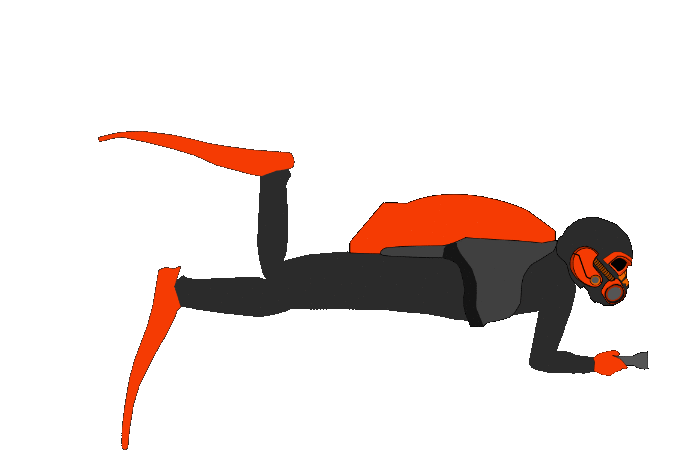

#Sprite Animation Project
William Karges Spring 2015
##Description:
 This project draws an underwater background and animates a diver .gif and generates bubbles when the space bar is held down.  This project was mostly an expirement to find out how to animate a sprite in open frameworks.  I knew it wouldn't be much of a problem using a .gif file but I wanted to see if there was a way I could get my project to read a sprite sheet.  There are a few different spriteSheet addons on the openframeworks website but they either don't work or don't do sprite animations.  I'm sure I could write code to iterate through a spritesheet myself but that seems like more trouble than its worth when the ofxGif addon works just fine.

##How It Works
This project uses the ofxGif addon to run a sprite animation that moves across the screen.